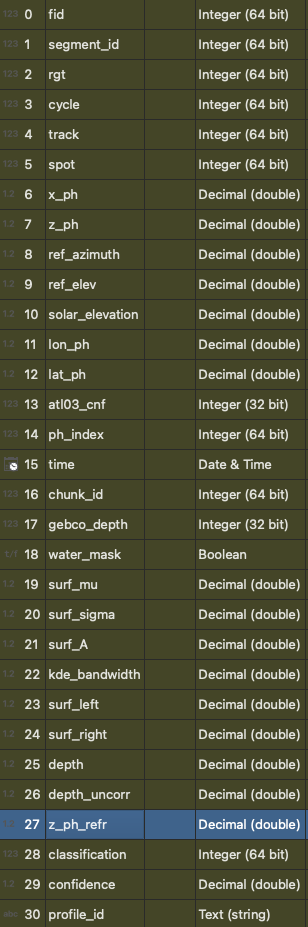

# MOD-ICESat2 Bathymetry
Tools for accessing and processing satellite-lidar bathymetry from NASAs ICESat-2.

## Setup
```bash
mamba env create -f env.yaml
```

## General Workflow
With any GeoJSON AOI...

### Land Mask Creation
1. Download intersecting [OPERA Dynamic Surface Water eXtent](https://search.earthdata.nasa.gov/search?q=dswx-hls) data from NASA EarthData Search (see link). 
2. Mosaic and clip surface water using ```python dswx/0_hls-mosaic.py <input_dir> <output_path> [--bbox <bbox_path>]```, where ```<input_dir>``` is your folder of DSWx tiles.

### Bathymetry Processing
1. Data Access. Configure NASA SlideRule request parameters at the top of `1_get_is2.py` and run to download ATL03 data. This may take several minutes depending on your AOI size and internet connection. 
2. Bathymetry Classification. Set up `config.yaml` as needed. To classify bathymetry, run `2_classify_is2.py`.

### Outputs
- bathymetry.gpkg: Bathymetry classified photon-rate data. Refraction corrected elevations (referenced to EGM08) are stored in the `z_ph_refr` field. Other key data such as time of acquistion, classification confidence (0-1), and water mask values are stored alongside geolocation / height data. 

